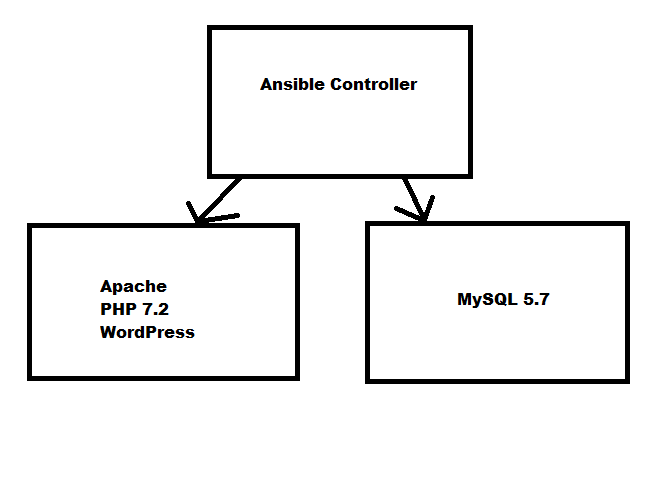

Provision Vagrant LAMP stack in Ansible for WordPress development

<h2>Provisions Vagrant machine for WordPress development</h2>

* Installs MySQL 5.7
* PHP 7.2
* Latest WordPress Installation

its a 100% ready to use LAMP stack for WordPress development

How can I select Ubuntu?

 Open Vagrantfile
There are two variables $OS

$OS = 'bento/ubuntu-16.04';  
$OS = 'bento/centos-6.9';

Comment one of them to have to other installed.

